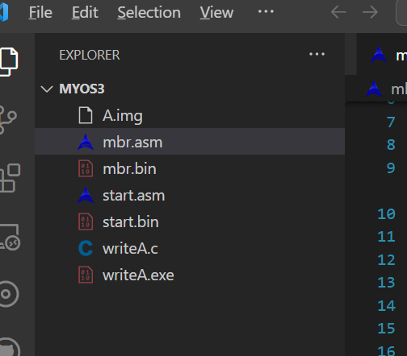
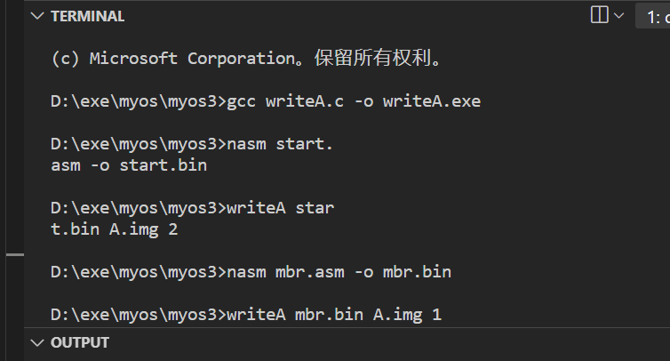
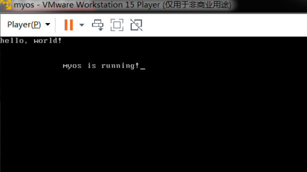
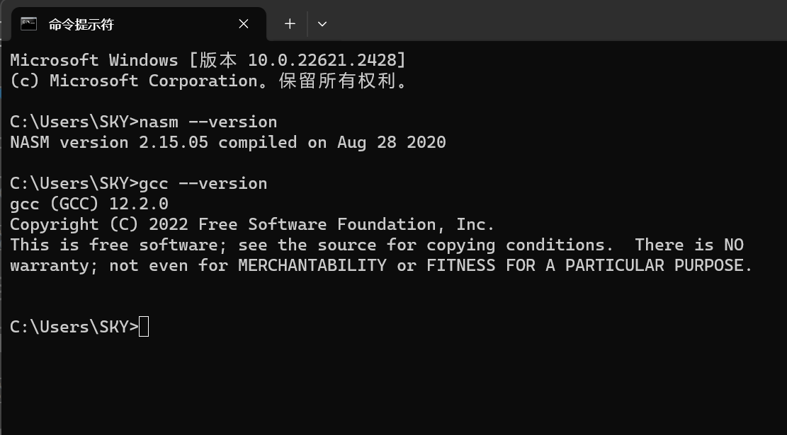
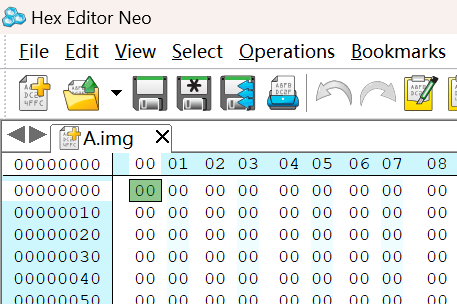
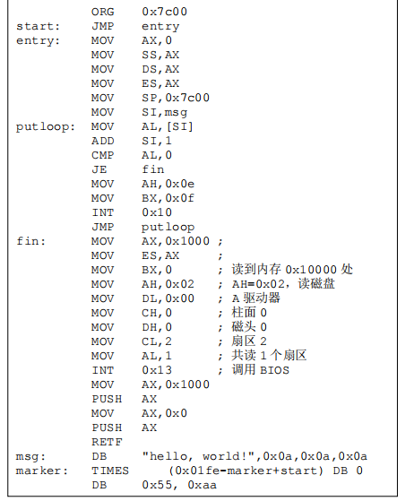

## 操作系统 实验报告二

### 21级软件工程一班 宁智伟 202131603131

### 实验题目：加载操作系统

### 实验时间：2023.10

### 实验内容：

#### 1.复制myos1到myos3并创建以下文件
  

  运行编译命令
  

  创建新的虚拟机，按照要求进行设置后启动，出现如下画面

  
  

### 实验目的

  让 MBR 加载操作系统，然后让 CPU 去执行操作系统，计算机系统正常运行。

### 实验环境

  在命令行对实验环境版本测试，结果如下图
  

### 实验步骤

  #### 1.A.img
  
  软盘镜像的意思是用一个磁盘文件来模拟软盘，也就是说，我们可以把硬盘上的一个文件当做软盘来用。首先，这个文件的扩展名必须是 img，表示软盘镜像文件，由于镜像文件要被虚拟机访问，因此扩展名必须是 img 实际上是由虚拟机要求的。文件名则可以任意命名，这里命名为 A，表示是 A 软盘。

  

  #### 2.编写MBR

  CPU 通过执行 BIOS 中的引导程序把MBR 读入到内存中，然后 CPU 通过执行 MBR 中的引导代码把操作系统读入到内存中，最后 CPU 执行内存中的操作系统，从而实现对计算机系统的管理。也就是说 MBR 是用来引导操作系统 myos 的。

  
  
  #### 3.汇编MBR并写入A.img

  执行writeA.exe 写入扇区

### 实验心得

  通过本次实验，我学习到了 MBR 如何加载操作系统，可执行文件格式、最简单的 myos、优雅的写入 myos 以及加载 myos 等知识，收益颇丰！