

## 操作系统 实验报告一

### 21级软件工程一班 宁智伟 202131603131

### 实验题目：启用C语言

### 实验时间：2023.11

### 实验内容：
  在 start.bin 的基础上增加操作系统的基本功能，编写操作系统的高级语言首选 C 语言。解决 C 语言编程的基本问题，内容主要包括 gcc 简介，头文件和库文件，基本工具集以及 x86 汇编与 C 语言的混合编程问题。

#### 1.gcc环境
  在命令行测试gcc环境

  

  gcc环境正常，版本为gcc (GCC) 12.2.0

#### 2.实验步骤
  1.复制之前的myos3文件夹内容至myos4文件夹

  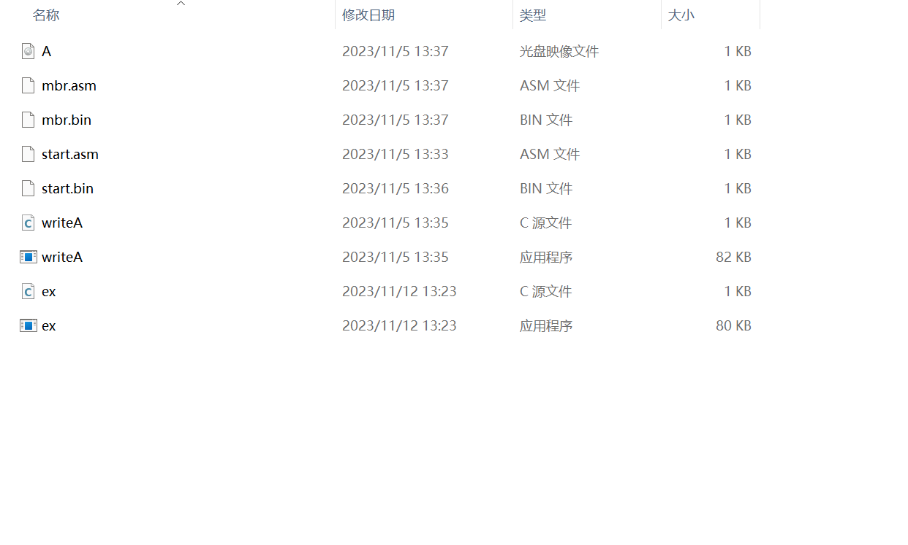

  2.新建ex.c文件，写入c源代码

  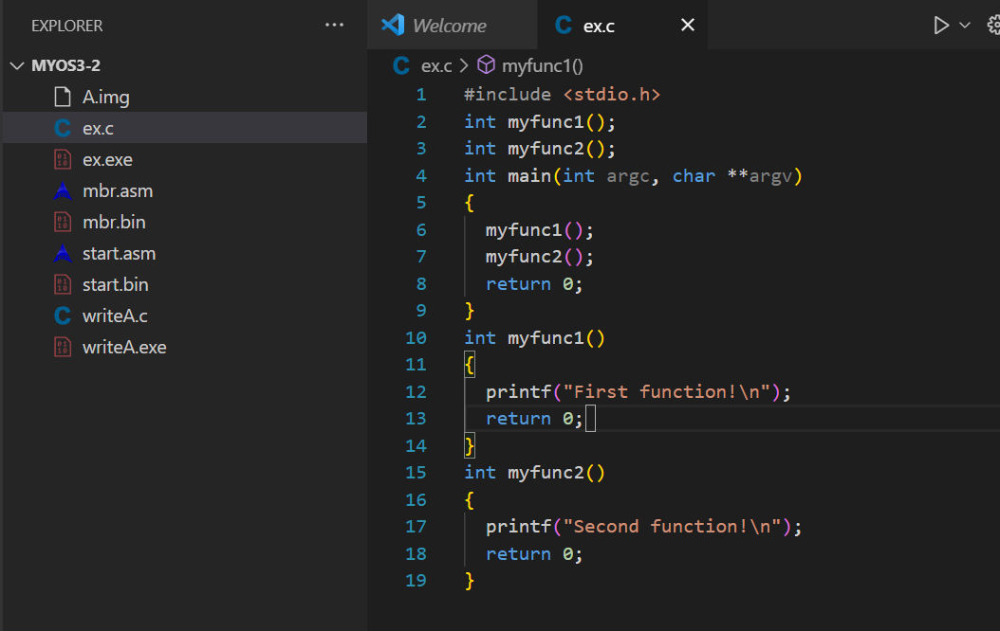

  3.编译ex.c，得到下图内容

  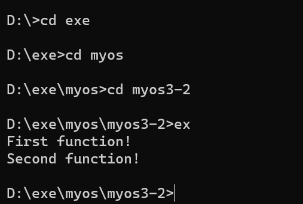

  4.把函数声明放到头文件ex.h中

  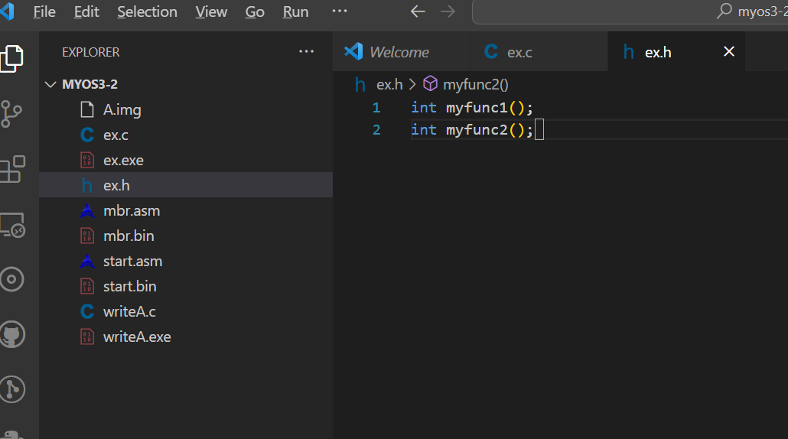

  5.把 myfunc1 函数的定义放到 C 语言源程序 ex1.c 中，如下所示。

  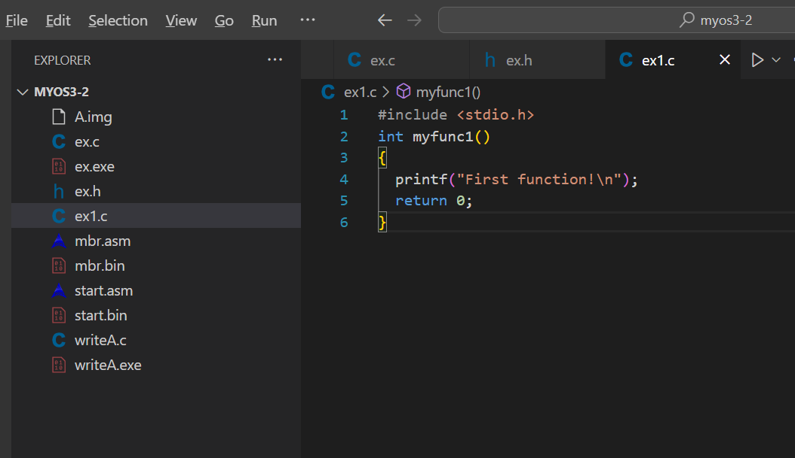

  6.把 myfunc2 函数的定义放到 C 语言源程序 ex2.c 中，如下所示：

  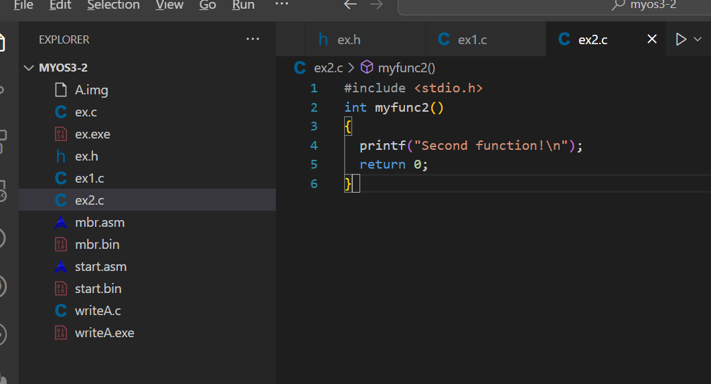

  7.然后修改 ex.c 为 ex3.c，如下所示。

  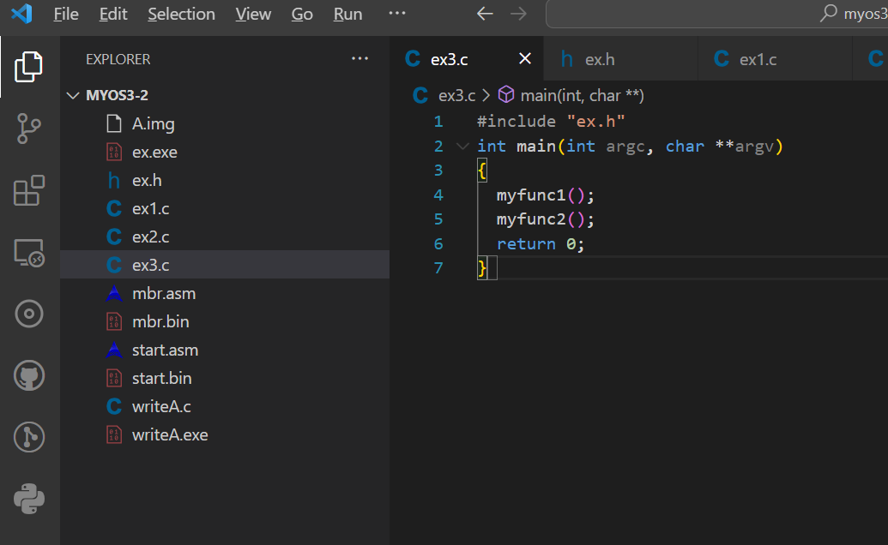

  8.用 gcc 编译并执行 ex3.c，注意 gcc 默认的输出文件为 a.exe

  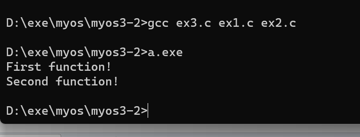

  9.用 C 语言写一个函数，然后从 start.bin 中跳转到该函数处继续执行。

  10.在 myos4 子目录下，首先修改 start.asm。

  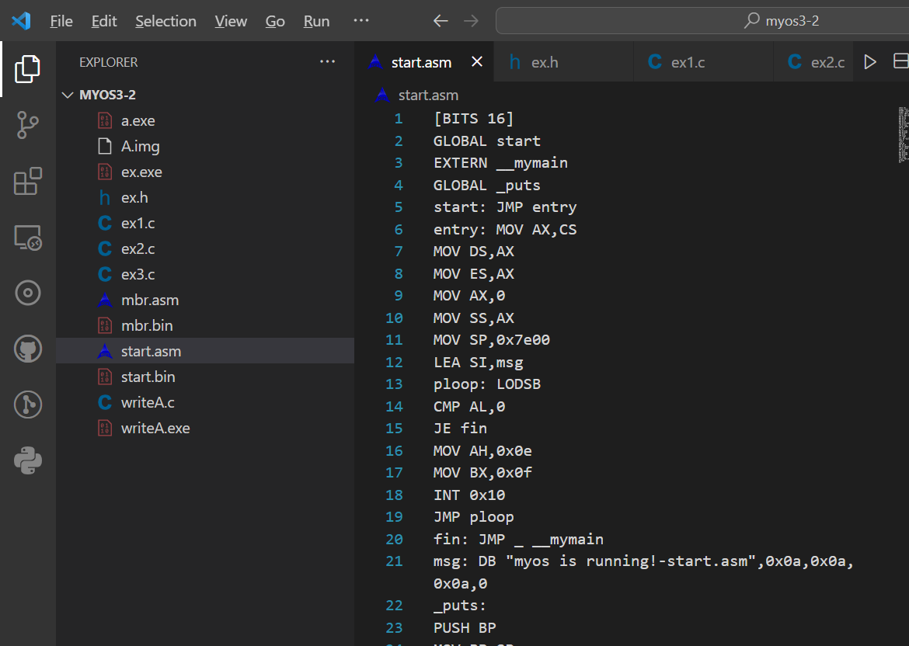

  11.在 myos4 子目录下，编写 C 语言程序 myos.c。

  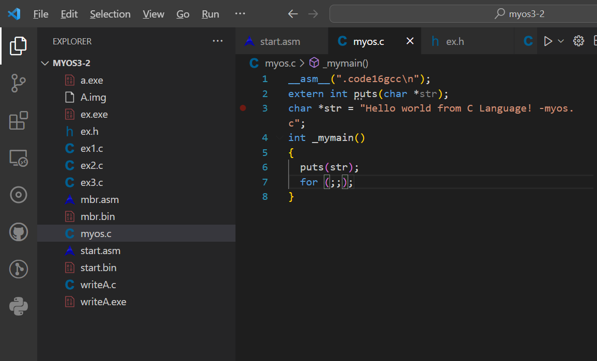

  12.汇编 start.asm

  

  (这里第一次出现了汇编错误，原因是第一次修改后JMP _ __mymain语法错误)

  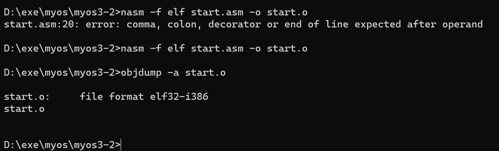

  13.编译 myos.c。myos.c 只能用“-c”选项编译成目标文件。

  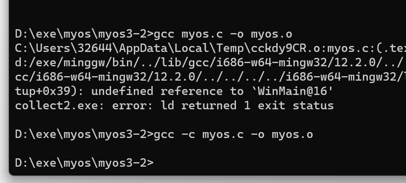

  14.最后，把它们链接成一个可执行文件。

  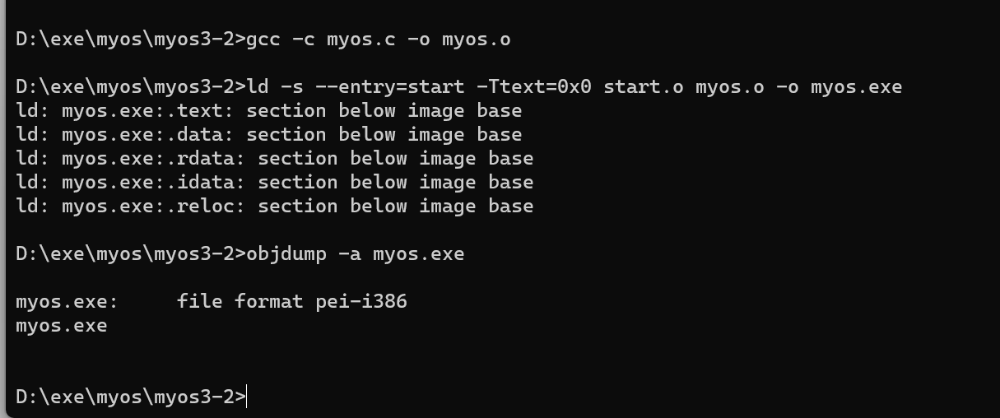

  (其中“-s”选项要求忽略输出文件中所有的符号信息，这可以有效减小可执行文件的大小，“--entry=start”选项及参数指出程序的入口点是 start.asm 中的 start 符号处，而“-Ttext=0x0”选项及参数则告诉链接器 text 节的绝对地址为 0，“-o myos.exe”选项及参数指出输出的可执行文件名为 myos.exe。)

  15.用 objcopy 工具将 myos.exe拷贝成纯二进制格式的可执行文件 myos.com.

  16.用工具 writeA.exe 把 myos.com 优雅的写入 A.img 中从第 2 个扇区开始的位置。

  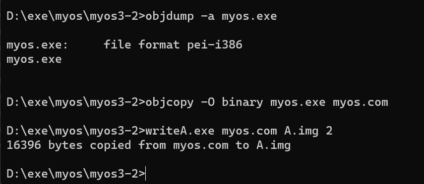

  17.测试操作系统
  
  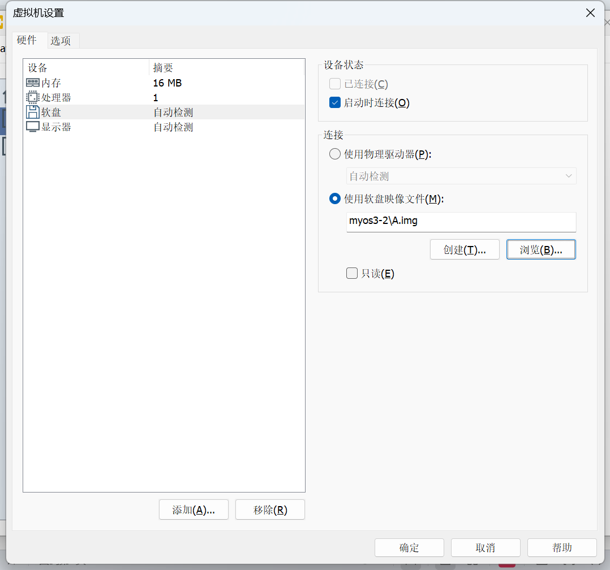

  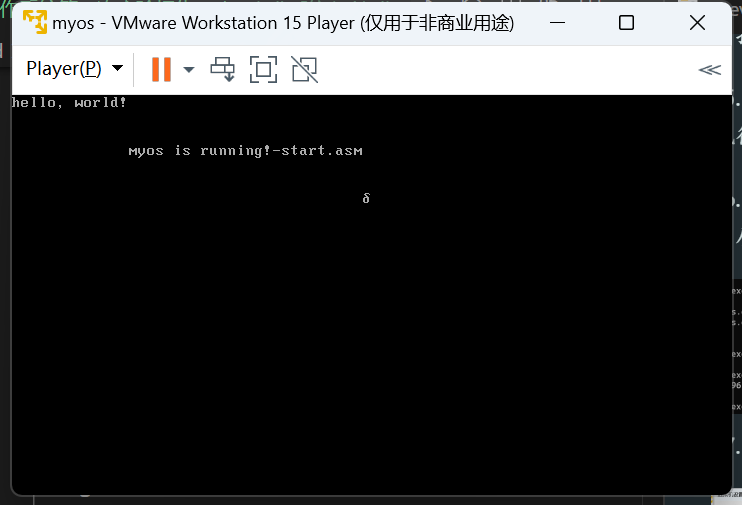

### 实验心得

  通过本次实验，我知道了怎么将C语言写入我们的操作系统，以及汇编代码和c语言代码之间的相互链接，收益颇丰！