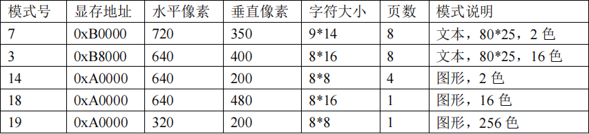
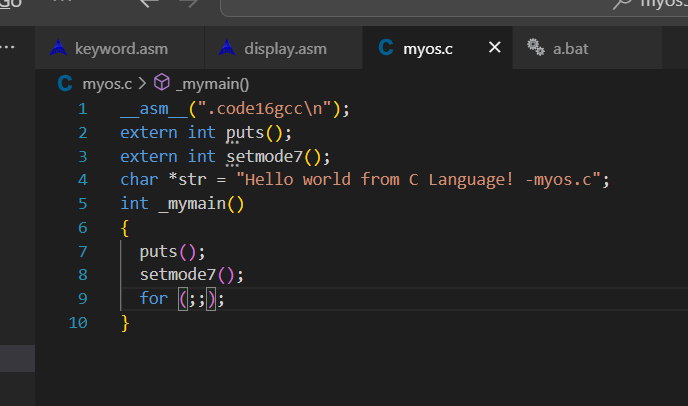
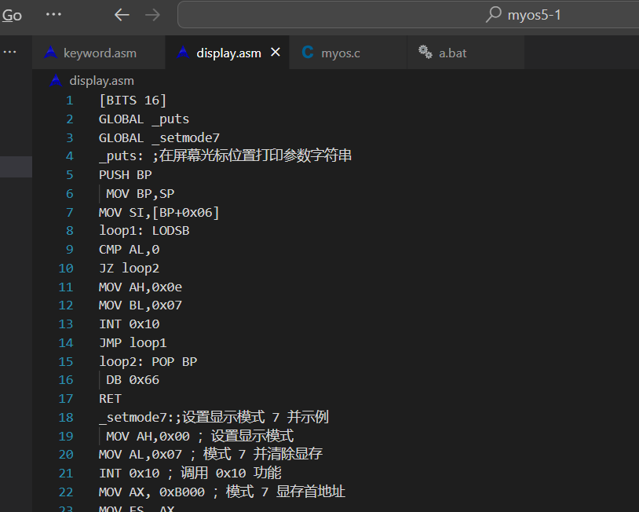
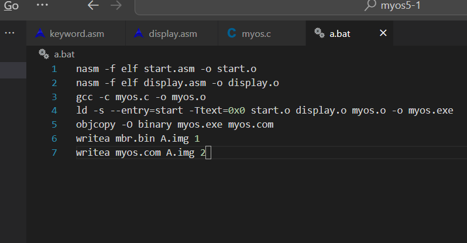
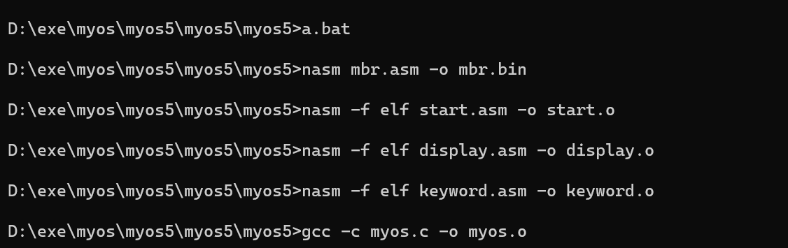
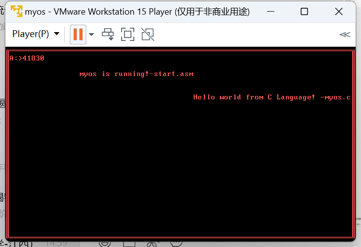
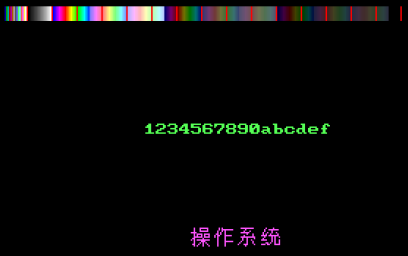
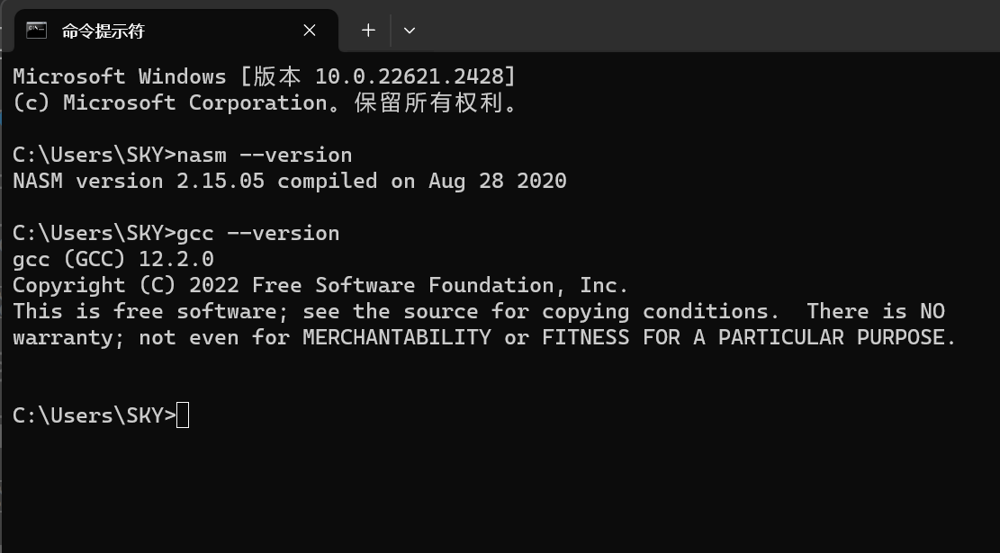

## 操作系统 实验报告一

### 21级软件工程一班 宁智伟 202131603131

### 实验题目：实验四--首先考虑显示

### 实验时间：2023.10

### 实验内容：
  $myos$ 已经具有了操作系统的基本框架和初步模样，接下来继续丰富 $myos$ 的主要功能。操作系统最终的结果要通过屏幕呈现给用户，首先考虑屏幕显示。

#### 1.设置显示模式
  设置当前的视频显示方式，包括显存的地址在哪里，是字符模式还是文本模式，屏幕分辨率是多少，能显示多少种颜色等。

  文本模式以字符为基本显示单位，在屏幕上只能显示字符；图形模式则以像素为基本显示单位，在屏幕上既可以显示图形，也可以显示字符。设置了显示模式之后，一方面可以调用 INT 0x10 的各种子功能实现屏幕显示；另一方面也可以根据不同显示模式的规定，通过直接向显存写数据来实现屏幕显示。

  

  显示模式 7 为黑白文本模式。屏幕大小为 720*350 像素，每个显示字符的点阵大小为9*14，这样算下来整个屏幕能显示 80 列*25 行个字符。模式 7 的显存地址从 0xB0000 开始，屏幕上显示的每个字符在显存中占用两个字节，第一个字节为该字符的 ASCII 码，第二个字节为该字符显示时的颜色属性，每个字符在显存中的地址与其在屏幕上显示的位置一一对应.

  先把 myos4 子目录复制一份，命名为 myos5。在 myos5 子目录下，首先删除完成历史使命的 ex 子目录，然后修改 myos.c 文件。在 myos.c 中，调用一个函数 setmode7()，并用extern 关键字将其申明为外部函数
  
  

#### 2.新建display.asm

  新建一个文件 display.asm，这个文件将来会把所有有关显示的用汇编语言写的函数都定义在该文件中。首先把原来在 start.asm 中定义的 puts 函数整理到 display.asm 中，然后再添加 setmode7 函数。

  

  目前 display.asm 中共有两个函数，一个是 puts，另一个是 setmode7。其中 setmode7 函数首先设置显示模式为清除显存的模式 7，然后根据模式 7 的显示设置分别向显存写几个字符及其颜色属性，最后返回。执行时这些字符及其对应的颜色就会显示在屏幕的左上角。
  
  由于增加了文件，因此 a.bat 也要修改。首先增加对 display.asm 的汇编，然后在链接时
增加 display.o 模块。

  

#### 4.执行 a.bat 完成编译与链接
  
  命令行执行a.bat, 没有错误执行成功
  
  

#### 5.执行软盘文件

  

   
   

  

### 实验目的

  通过前几次实验，已经基本了解了如何将自己的操作系统移植到虚拟机当中，而操作系统的最终表现形式是通过屏幕，我们需要将计算机当前的信息显示给用户，正是要通过屏幕来表现。

### 实验环境

  在命令行对实验环境版本测试，结果如下图
  

### 实验心得

  通过本次实验，知道了如何通过排名显示我们想要输出的信息，后续的实验结果也是要通过屏幕来展现给用户，这是非常重要的一步。