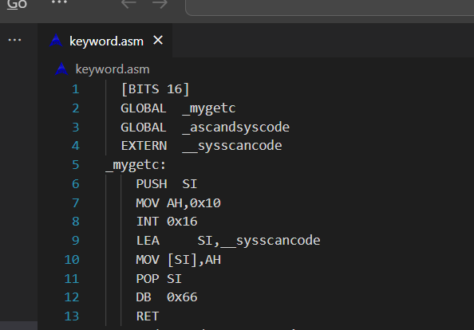
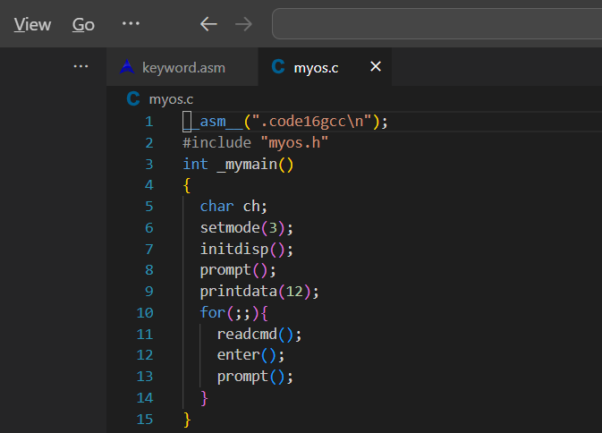
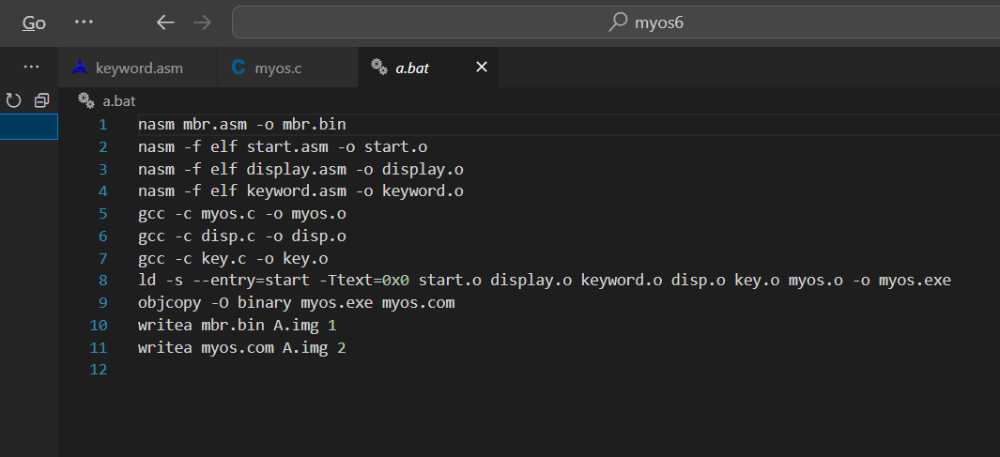
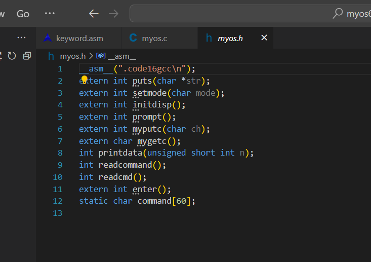
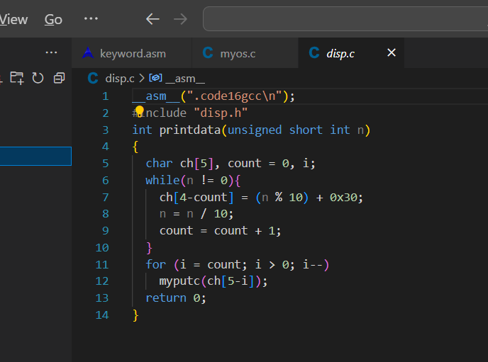
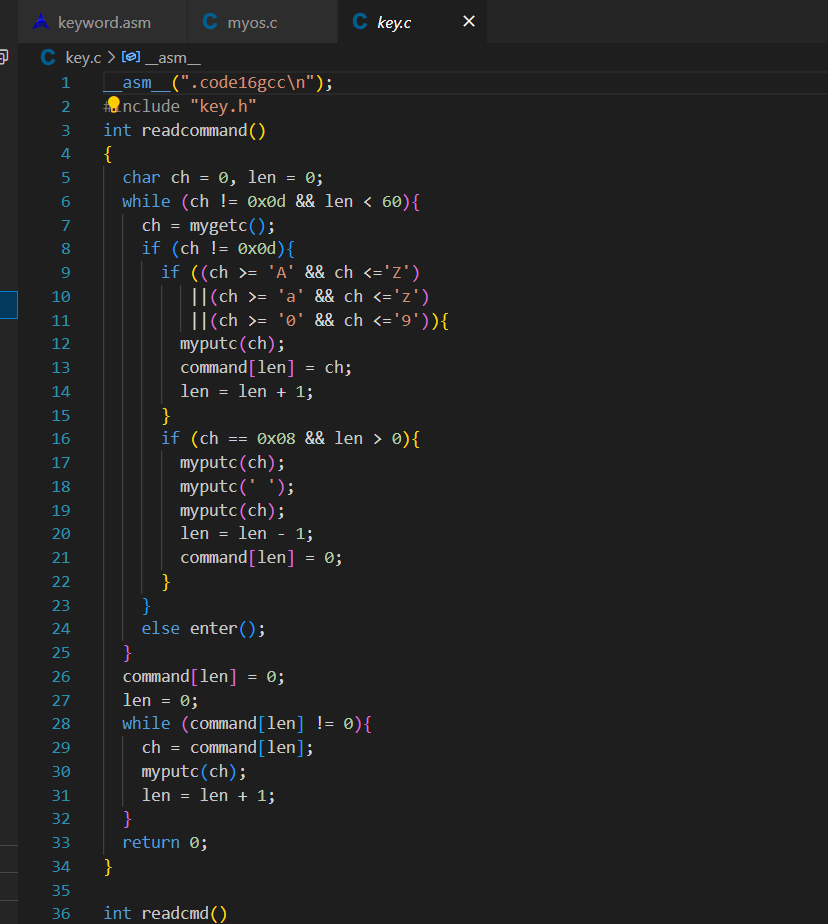
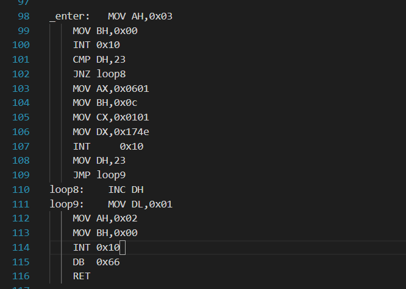
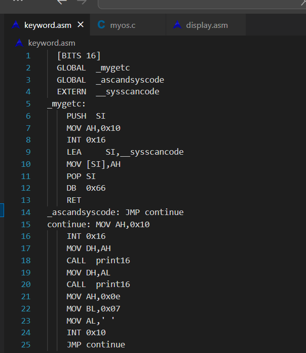
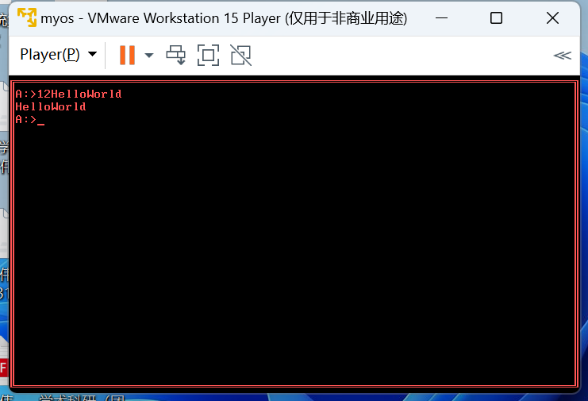

## 操作系统 实验报告五

### 21级软件工程一班 宁智伟 202131603131

### 实验题目：实验五--键盘工作原理

### 实验时间：2023.11

### 实验目的：
  通过之前的实验，已经初步了解了屏幕显示的原理，知道了如何通过编程来控制屏幕显示，并完成了$myos$的基本页面。接下来实现键盘的输入。
  
### 实验内容：
  接下来就是如何实现键盘的输入，并将其显示在屏幕上面。键盘与主机系统的交互是异步的，处理这种异步交互的最常用手段就是中断和缓冲。

  键盘是一个按键的阵列，按键本身有机械键盘、塑料薄膜式键盘、导电橡胶式键盘和无接触静电电容式键盘等；根据按键数量又有 83 键、84 键、96 键、101 键和 104 键等；根据编码原理又可分为全编码键盘和非编码键盘。

  $PC$ 机的键盘主要是非编码键盘。

  如果在键盘缓冲区内有一个键，那么就从缓冲区中读走该键并保存在 AX 寄存器中，同时修改缓冲区指针；如果没有键，那么该子功能将阻塞在键盘上一直等待，直到有一个按键，然后读取并返回。

### 实验步骤

#### 1.$mygetc$ 函数
  将 $myos5$ 复制一份，重命名为 $myos6$。在 $myos6$ 子目录下，新建文件 $keyword.asm$，在其中定义 $mygetc$ 函数。

 $mygetc$ 函数的功能实现比较简单，只要调用 $INT 0x16$ 的 0x10 子功能即可，关键问题是如何将获取的键值返回给调用者。一是通过全局变量的方式实现。在 $C$ 程序中定义一个字符型的全局变量，然后在汇编程序中将其用 $GLOBAL$ 声明为外部符号，注意在 $C$ 中是一个下划线，在汇编中是两个下划线。这种方式下 $keyword.asm$ 的内容如下所示：

  

  $myos.c$ 内容如下所示：
  
  

  修改$a.bat$

  

#### $readcommand$ 函数

  接下来，利用 $mygetch$ 函数，用 $C$ 语言实现一个从键盘读取命令并显示在命令行上的函数 $readcommand$。简单起见，做如下约定：命令长度小于 60 个字符，且只能为英文大小写字母以及数字键，以 $Enter$ 键作为命令结束符，在输入过程中可通过 $Backspace$ 键进行修改。
  
  先把以前的代码归整一下。把 $myos.c$ 文件中 $mymain$ 函数之前的声明和定义，归整在头文件 $myos.h $中，其中 $str$ 字符串已经完成了历史使命，就不再定义，同时在 $mymain$ 中也不调用 $puts$ 函数。$myos.h$ 中的内容如下：

  

  $printdata$ 函数定义在 $disp.c$ 文件中，为之配套 $disp.h$。$disp.c$ 文件的内容目前如下：

  

  $readcommand$ 函数定义在 $key.c$ 文件中，为之配套 $key.h$，考虑到命令缓冲区 $command$将来还要被其他函数调用，因此“static char command[60];”被定义在 $myos.h$ 文件中。$key.c$文件的内容目前如下：

  

#### $readcmd$ 函数

  参照 $cmd$ 命令提示符下的命令输入方法，实现另一个从键盘读取命令的函数$readcmd$，该函数在读取命令的过程中，可通过左右方向键移动光标，通过 $Backspace$ 键删除光标前一个位置的字符，通过 $Delete$ 键删除光标所在位置的字符，还可以把光标移到命令中间添加字符。
  
  首先，我们需要实现一个显示 $Enter$ 键功能的函数。$Enter$ 键的 ASCII 码是 0x0d，这是一个控制字符，显示在屏幕上的作用是光标回到行首，让光标到下一行还需要显示另一个换行控制字符 0x0a。但仅仅显示这两个控制字符还不行，因为$ myos $的屏幕四周有边框，另外，光标在最下面一行时，还需要向上滚动屏幕。因此，需要用到 INT 0x10 的有关光标设置和屏幕滚动的子功能，基于此，$enter$ 函数用汇编语言实现，定义在$ display.asm$ 文件中，申明在 $myos.h $文件中，具体内容如下：

  

  修改 $mygetc$ 函数，以全局变量的方式同时返回相同扫描码。在 $key$.h 中定义字符型全局变量_sysscancode，修改后的 $mygetc$ 函数在 keyword.asm 文件中如下所示：

  

### 实验结果

  执行 $a.bat$ ，将 $A.img$ 设为虚拟机软盘，结果如图所示

  

### 实验环境

  在命令行对实验环境版本测试，结果如下图
  

### 实验心得

  通过前几次实验，实现了在$myos$界面的信息显示，而我们自己输入的信息也要通过屏幕显示的方式，首先要通过键盘获取输入信息，然后通过屏幕将输入信息展现在$myos$界面上，通过本次实验，实现了键盘的输入及输入信息的显示，收获颇丰！