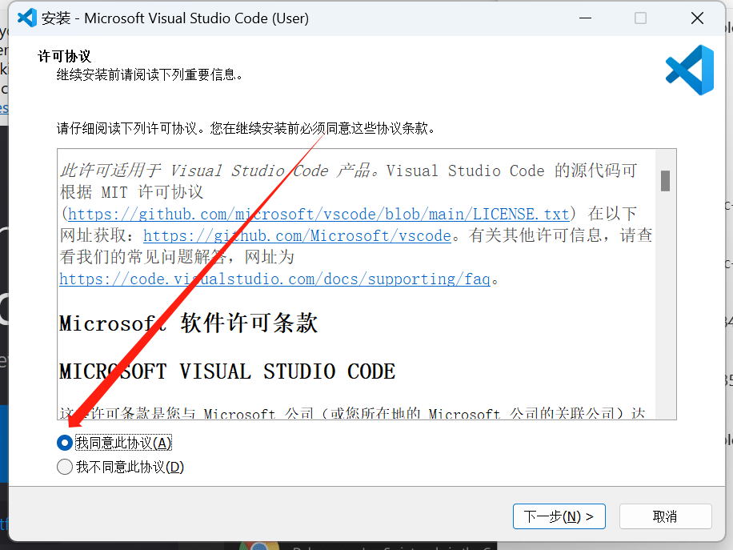
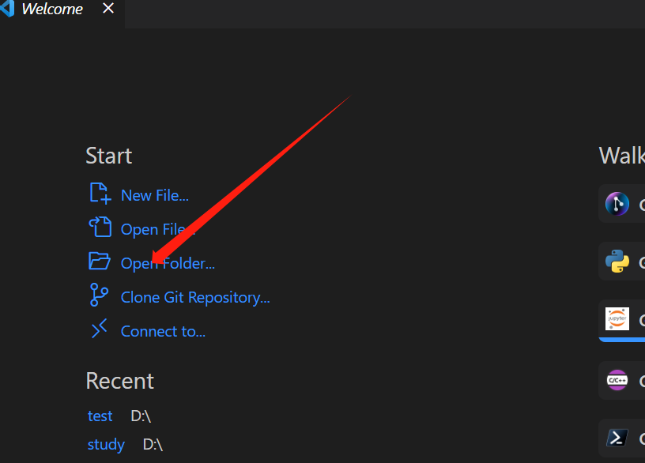
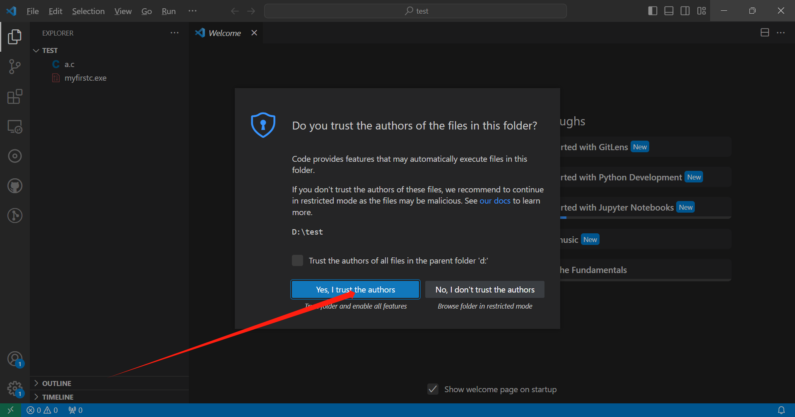
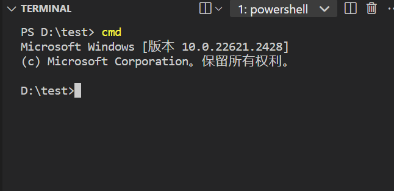
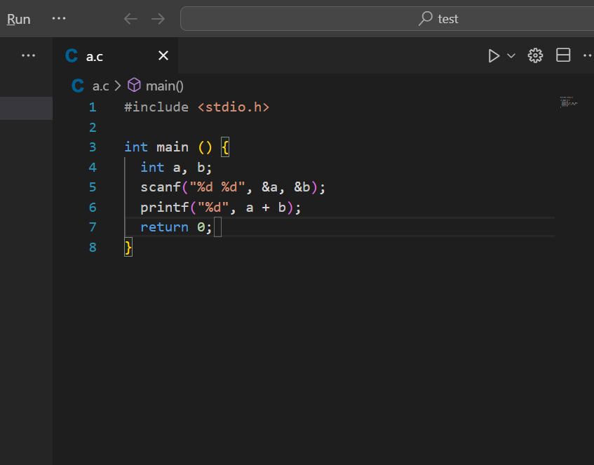

# $g++，gcc，VsCode$环境配置及如何用$VsCode$ 运行$C$语言代码（$Windows ~ 64$位）
#  -- $NWNU ~ ICPC$ 集训队 宁智伟
## $\mathcal{Minggw ~~ vscode ~~~ BY ~~~ HONG-LOU ~~ 2023.11.7} $

## $1.minggw$环境
  $MinGW$ 的全称是：$Minimalist GNU on Windows$ 。它实际上是将经典的开源 $C$ 语言 编译器 $GCC$ 移植到了 $Windows$ 平台下，并且包含了 $Win32API$ ，因此可以将源代码编译为可在 $Windows$ 中运行的可执行程序。而且还可以使用一些 $Windows$ 不具备的，$Linux$平台下的开发工具。一句话来概括：$MinGW$ 就是 $GCC $的 $Windows $版本 。

  以上是 $MinGW$ 的介绍，$MinGW-w64$ 与 $MinGW$ 的区别在于 $MinGW$ 只能编译生成$32$位可执行程序，而 $MinGW-w64$ 则可以编译生成 $64$位 或 $32$位 可执行程序。

  鉴于现在大部分电脑都是$64$位，所以给大家准备的是$64$位的压缩包。

  下载后解压确保电脑有解压功能或安装了解压工具（自行百度）

  

  #### 在$D$盘自己知道的位置新建$minggw$文件夹

  

  #### 将$minggw$压缩包解压至该文件夹，效果如下

  

  #### 进入$bin$文件夹，点击上方地址，$“ctrl” + “c”$复制该地址

  

  #### 电脑设置搜索环境变量（系统环境变量）

  

  #### 点击环境变量

  

  #### 找到$path$双击进入编辑

  

  #### 点击新建，复制我们刚才粘贴的路径

  

  #### 点击确定退出（一定要三个页面都点确定！！！）

  #### 键盘 $"win" + "R"$ 或搜索cmd进入命令行

  

  #### 输入命令测试环境，如结果为下图则为配置成功

  

  #### 建议此时重启电脑再次进行测试

  ~~~
  gcc是GCC中的GUN C Compiler（C 编译器）

  g++是GCC中的GUN C++ Compiler（C++编译器）

  由于编译器是可以更换的，所以gcc不仅仅可以编译C文件

  所以，更准确的说法是：gcc调用了C compiler，而g++调用了C++ compiler

  gcc和g++的主要区别

  1. 对于 *.c和*.cpp文件，gcc分别当做c和cpp文件编译（c和cpp的语法强度是不一样的）

  2. 对于 *.c和*.cpp文件，g++则统一当做cpp文件编译

  ~~~

## $2.$编译$c$文件

  对于编辑器，本质就是调用$g++$或$gcc$命令，下面的操作可能能使你明白编译的过程

  #### 命令行进入$D$盘并创建$test$文件夹

  

  #### 以记事本方式创建$a.c$

  

  #### 编写代码，并 $ctrl + s$ 保存退出

  

  #### 命令行使用$gcc$命令编译

  

  gcc a.c -o myfirst.exe

  -o 是用于指定要生成的结果文件，我们c文件一般生成exe可执行文件，后面跟的就是生成的文件名

  这是我们会发现我们$test$文件夹下面就多出了一个$myfirstc.exe$

  

  #### 继续使用命令行执行$exe$得到运行结果

  

  **希望大家能以此理解$c$源文件的编译和运行方式**

## $3.vscode$下载安装

  #### 在浏览器搜索$vscode$并进入，我使用的是$Edge$浏览器$bing$搜索，建议大家也使用$Edge+bing$，自行百度。

  

  

  #### 打开下载好的文件，点击同意协议

  

  #### 在D盘找个位置新建$vscode$文件夹

  

  #### 选择安装位置为刚才新建的$vscode$文件夹

  

  #### 选项全选

  

  #### 完成安装

  

  #### 进入$vscode$，点击$file，open folder$ 或直接点击开始页面$open folder$

  

  #### 到$D$盘打开我们之前新建的$test$文件夹

  

  #### 点击授予读写权限

  

  #### 这时候我们就可以在侧边栏看到我们之前新建的文件了

  

  #### 点击$file$按钮，有个$auto ~~ save$一定要勾选，这样就不用每次再$ctrl + s$来保存了

  

## $4.vscode$运行$c$语言

  #### 安装$vscode$运行$c$语言所需要的插件

  

  #### 搜索$c++$，点击$install$（我这个之前安装过所以没有）

  

  #### 同理，安装$code ~~ runner$

  

  #### 打开之前新建的$a.c$文件

  同样的我们进行环境测试,$vscode$ 中键盘"$ctrl$" + "~" 打开$terminal$，$powershell$中输入$cmd$进入$cmd$命令行

  

  

  #### cmd命令行中输入$gcc ~~ --version$

  

  没有问题

  

  #### 展开编译按钮，选择$run ~~ code$

  

  #### 这时，$hello ~~ world$ 程序就运行成功了

  

  #### 我们再写一个有输入输出的$c$文件

  

  这时候再$run~~ code$运行发现编译成功但是无法输入，这是应为我们的程序当前没有运行在$terminal$中只是$output$所以无法输入

  #### $“ctrl” + “，”$进入$vscode$设置

  

  #### 搜索$run~~ in ~~terminal$

  #### 下翻找到$code ~~ runner$选项并勾选

  

  #### 此时再打开刚才写好的输入输出文件，发现成功运行并可以输入输出

  

#### 这样以后就可以在$vscode$中编译运行$c$语言源文件了

$Tips：$

  $vscode$可以安装许多有用或者有趣的插件，例如网易云音乐

  

  这样你就可以和我一样边听歌边写代码了哈哈哈

  

  **加油，希望大家都能以最舒服的状态写代码**